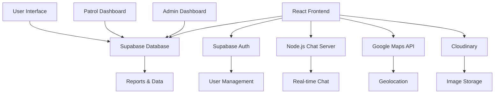

# 🚗 Cars-G: Community Safety Platform

<div align="center">


**A comprehensive community safety platform that empowers residents to report issues, coordinate with patrol officers, and build safer neighborhoods through technology.**

[](https://cars-g.vercel.app)
[](https://cars-g-api.onrender.com)
[](#tech-stack)

</div>

---

## 🌟 Overview

**Cars-G** is a full-stack community safety platform that revolutionizes how neighborhoods handle safety concerns. Built with modern web technologies, it provides a seamless experience for residents, patrol officers, and administrators to collaborate on making communities safer.

### 🎯 Key Features

- **📱 Real-time Reporting System** - Residents can instantly report safety issues with photos and location data
- **🗺️ Interactive Map Dashboard** - Visual representation of all reports with real-time updates
- **👮‍♂️ Patrol Management** - Dedicated dashboard for patrol officers with ticketing system
- **💬 Real-time Chat** - WebSocket-powered communication between users and officers
- **📊 Admin Analytics** - Comprehensive dashboard with statistics and user management
- **🏆 Gamification** - Achievement system and leaderboard to encourage community participation
- **📱 PWA Support** - Installable app with offline capabilities and push notifications

---

## 🚀 Live Demo

**Experience the platform:** [cars-g.vercel.app](https://cars-g.vercel.app)

**Test Credentials:**
- **User:** `demo@cars-g.com` / `demo123`
- **Patrol:** `patrol@cars-g.com` / `patrol123`
- **Admin:** `admin@cars-g.com` / `admin123`

---

## 🛠️ Tech Stack

### Frontend
- **React 18** with TypeScript for type-safe development
- **Vite** for lightning-fast development and building
- **Tailwind CSS** for responsive, utility-first styling
- **Framer Motion** for smooth animations and transitions
- **React Router** for client-side routing
- **Zustand** for state management
- **React Query** for server state management

### Backend & Database
- **Supabase** for PostgreSQL database and authentication
- **Node.js + Express** for real-time chat server
- **Socket.IO** for WebSocket connections
- **Row Level Security (RLS)** for data protection

### Maps & Location
- **OpenStreetMap** for admin map dashboard
- **Leaflet** for interactive map components

### DevOps & Deployment
- **Vercel** for frontend deployment
- **Render** for backend hosting
- **Cloudinary** for image storage and optimization
- **GitHub Actions** for CI/CD

### Testing & Quality
- **Jest** for unit testing
- **Cypress** for end-to-end testing
- **ESLint + Prettier** for code quality
- **Husky** for git hooks

---

## 🏗️ Architecture



---

## 🎨 User Roles & Features

### 👥 Community Members
- **Report Issues** - Submit safety concerns with photos and precise location
- **Track Progress** - Monitor report status and receive updates
- **Chat System** - Communicate directly with patrol officers
- **Leaderboard** - Earn points and achievements for community participation
- **Mobile App** - PWA with offline capabilities

### 👮‍♂️ Patrol Officers
- **Case Management** - Handle reports with unique case numbers and priority levels
- **Assignment System** - Assign cases to specific groups and officers
- **Real-time Updates** - Receive instant notifications for new reports
- **Map Dashboard** - Visual overview of all active cases
- **Communication** - Chat with community members and other officers

### 🔧 Administrators
- **Analytics Dashboard** - Comprehensive statistics and insights
- **User Management** - Manage user accounts and permissions
- **System Settings** - Configure platform settings and announcements
- **Report Oversight** - Monitor and manage all platform activity
- **Map Visualization** - Real-time map with all reports and status updates

---

## 📱 Key Features Deep Dive

### 🗺️ Interactive Map Dashboard
- **Real-time Updates** - Live map showing all reports with color-coded status
- **Smart Markers** - Priority indicators and status-based coloring
- **Instant Notifications** - Alerts for new reports with pulsing animations
- **Advanced Filtering** - Search and filter by status, location, or user

### 💬 Real-time Chat System
- **WebSocket Technology** - Instant message delivery
- **Typing Indicators** - See when others are typing
- **Message History** - Persistent chat history in database
- **File Sharing** - Support for images, files, and location sharing
- **Mobile Responsive** - Optimized for all devices

### 🎯 Ticketing System
- **Unique Case Numbers** - 6-digit case identifiers (e.g., #010001)
- **Priority Levels** - 1-5 scale with visual indicators
- **Assignment Tracking** - Group and officer assignment system
- **Comment System** - Full audit trail with timestamps
- **Status Management** - Pending, In Progress, Resolved, Rejected

### 🏆 Gamification
- **Achievement System** - Unlock badges for various activities
- **Point System** - Earn points for community participation
- **Leaderboard** - Community rankings and recognition
- **Progress Tracking** - Visual progress indicators

---

## 🚀 Getting Started

### Prerequisites
- Node.js 18+ and npm
- Supabase account
- Google Maps API key
- Cloudinary account (optional)

### Installation

1. **Clone the repository**
   ```bash
   git clone https://github.com/yourusername/cars-g.git
   cd cars-g
   ```

2. **Install dependencies**
   ```bash
   npm install
   cd server && npm install && cd ..
   ```

3. **Environment setup**
   ```bash
   cp env.example .env
   ```
   Configure your environment variables in `.env`

4. **Database setup**
   - Create a Supabase project
   - Run the SQL migrations in `supabase/migrations/`
   - Configure RLS policies

5. **Start development servers**
   ```bash
   # Frontend
   npm run dev
   
   # Backend (in separate terminal)
   npm run chat:start
   ```

6. **Access the application**
   - Frontend: `http://localhost:5173`
   - Backend: `http://localhost:3001`

---

## 📊 Performance & Optimization

- **⚡ Vite Build System** - Lightning-fast development and optimized production builds
- **🔄 Code Splitting** - Lazy-loaded components for faster initial load
- **📱 PWA Features** - Service workers for offline functionality
- **🖼️ Image Optimization** - Cloudinary integration for responsive images
- **📈 Bundle Analysis** - Built-in bundle analyzer for optimization
- **🎯 Performance Monitoring** - Real-time performance metrics

---

## 🧪 Testing

```bash
# Unit tests
npm test

# E2E tests
npm run cypress:open

# Test coverage
npm run test:coverage

# Deployment testing
npm run test:deployment
```

---

## 📈 Analytics & Monitoring

- **Vercel Analytics** - Real-time user analytics
- **Performance Monitoring** - Built-in performance tracking
- **Error Tracking** - Comprehensive error boundary system
- **User Engagement** - Achievement and leaderboard metrics

---

## 🔒 Security Features

- **Row Level Security (RLS)** - Database-level access control
- **JWT Authentication** - Secure token-based authentication
- **Input Validation** - Comprehensive input sanitization
- **CORS Protection** - Cross-origin request security
- **Environment Variables** - Secure configuration management

---

## 🌐 Deployment

### Frontend (Vercel)
```bash
npm run build
# Deploy to Vercel
```

### Backend (Render)
```bash
cd server
npm run build
# Deploy to Render
```

### Database (Supabase)
- Automatic migrations through Supabase dashboard
- Environment-specific configurations

---

## 📱 Mobile Experience

- **Progressive Web App (PWA)** - Installable on mobile devices
- **Responsive Design** - Optimized for all screen sizes
- **Touch-Friendly** - Mobile-first interaction design
- **Offline Support** - Service worker for offline functionality
- **Push Notifications** - Real-time alerts and updates

---

## 🤝 Contributing

1. Fork the repository
2. Create a feature branch (`git checkout -b feature/amazing-feature`)
3. Commit your changes (`git commit -m 'Add amazing feature'`)
4. Push to the branch (`git push origin feature/amazing-feature`)
5. Open a Pull Request

---

## 📄 License

This project is licensed under the MIT License - see the [LICENSE](LICENSE) file for details.

---

## 🙏 Acknowledgments

- **Supabase** for the amazing backend-as-a-service platform
- **Vercel** for seamless deployment and hosting
- **Google Maps** for geolocation services
- **OpenStreetMap** for free mapping tiles
- **React Community** for the incredible ecosystem

---

## 📞 Contact

**Kevin** - [GitHub](https://github.com/kevinmilespogi05) - [LinkedIn](https://www.linkedin.com/in/kevin-miles-julhusin-970354370/)

**Project Link:** [https://github.com/kevinmilespogi05/cars-g](https://github.com/kevinmilespogi05/cars-g)

---

<div align="center">

**⭐ Star this repository if you found it helpful!**

*Built with ❤️ for safer communities*

</div>
